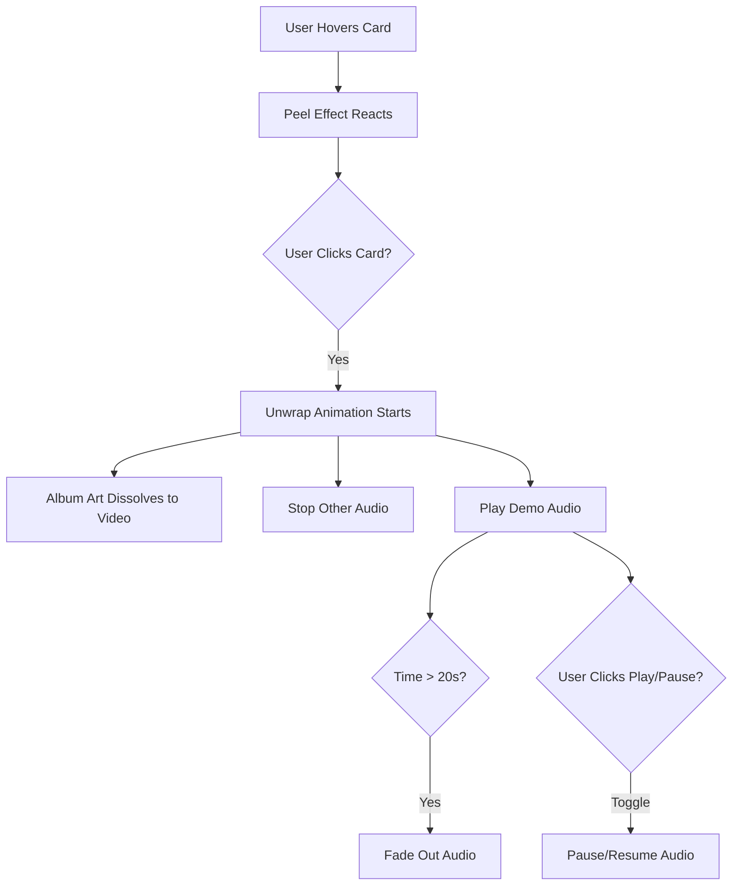

## 1. Product Overview
Myind Sound Releases is a digital music distribution platform allowing users to purchase and download music ("Pay What You Want") and preview upcoming releases. The core experience revolves around tactile, interactive album art featuring a realistic "sticker peel" effect that users can interact with to "unwrap" content, revealing music videos and audio demos.

## 2. Core Features

### 2.1 User Roles
| Role | Registration Method | Core Permissions |
|------|---------------------|------------------|
| Guest | None | Browse albums, play demos, purchase tracks (guest checkout). |
| Registered User | Email/Supabase Auth | Access purchase history, download previously bought tracks. |

### 2.2 Feature Module
Our platform consists of the following main pages:
1. **Home page**: Main landing area featuring the current "Digital" release (Lit) and a "Coming Soon" section for future projects.
2. **Physical page**: Storefront for physical merchandise (CDs, apparel).
3. **Login/Dashboard**: User authentication and library access.

### 2.3 Page Details

| Page Name | Module Name | Feature description |
|-----------|-------------|---------------------|
| **Home page** | **Hero Section (Lit Album)** | • **Interactive Peel**: A realistic sticker peel overlay covers the album art.  • **Alignment**: The peel overlay must align perfectly (1:1) with the album container, ensuring no visual discrepancy between the peel and the underlying art.  • **Purchase**: "Pay What You Want" input and checkout flow. |
| | **Coming Soon Section** | • **Grid Layout**: Displays cards for upcoming albums (e.g., C-WALK, THE SOURCE).  • **Peel Interaction**: Each card features an interactive peel. On click, the peel animates to "unwrap" the album.  • **Visual Transition**: Smoothly transitions from the static album art to a looping video background. The art should dissolve/fade out as the video plays (no abrupt cuts).  • **Audio Demo**: Plays a specific 20-second clip of the song upon unwrapping.  • **Audio Controls**: Play/Pause button toggles the specific track.  • **Exclusive Playback**: Starting one demo immediately cuts off/stops any other currently playing demo.  • **Audio Fade**: The audio track must smoothly fade out at the end of the 20-second clip. |

## 3. Core Process

**User Interaction Flow (Coming Soon Demo)**

## 4. User Interface Design

### 4.1 Design Style
- **Theme**: Dark, atmospheric with "glow" effects.
- **Interactive Elements**: High-fidelity "Sticker Peel" animation using GSAP.
- **Colors**: Dark backgrounds, neon/glow accents (Green/Red indicators implied by context).
- **Typography**: Clean, modern sans-serif.

### 4.2 Page Design Overview

| Page Name | Module Name | UI Elements |
|-----------|-------------|-------------|
| **Home page** | **Album Art Container** | **Strict Alignment**: The "Peel" canvas/overlay must match the dimensions of the underlying image exactly. No pixel gaps or scaling mismatches. |
| | **Coming Soon Card** | **Transition**: Cross-dissolve animation between the poster image and the background video.  **Controls**: Minimalist Play/Pause icon that appears after unwrapping. |

### 4.3 Responsiveness
- **Desktop-First**: Optimized for mouse interactions (hover/drag on peel).
- **Touch Support**: Touch events for peeling on mobile devices.

### 4.4 3D/Animation Guidance
- **Peel Physics**: The peel effect should simulate physical paper resistance.
- **Motion**:
    - **Unwrap**: 1.8s cubic-bezier transition for the peel removal.
    - **Video Reveal**: 0.6s ease-out opacity fade for the video (synchronized with peel).
