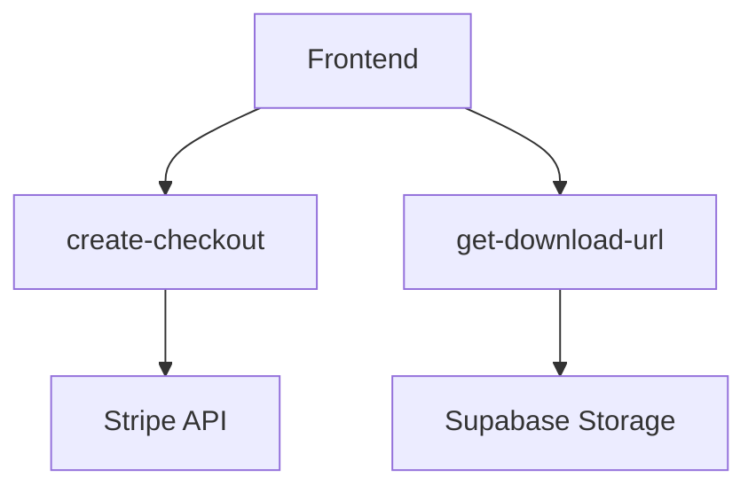

## 1. Architecture Design

The application follows a client-side rendering architecture powered by Vite, utilizing Supabase for backend services (Auth, Database) and Netlify Functions for server-side logic (payments).

```mermaid
graph TD
  A[User Browser] --> B[Vite/Vanilla TS App]
  B --> C[GSAP Animation Engine]
  B --> D[Supabase SDK]
  B --> E[Netlify Functions]
  
  subgraph "Frontend Layer"
    B
    C
  end

  subgraph "Backend Services"
    D[Supabase (Auth/DB)]
    E[Serverless Functions]
  end
```

## 2. Technology Description

- **Frontend**: Vanilla TypeScript, HTML5, CSS3
- **Build Tool**: Vite
- **Animation**: GSAP (GreenSock Animation Platform) + Draggable
- **Backend**: Supabase (PostgreSQL, Auth)
- **Serverless**: Netlify Functions (Node.js)

## 3. Route Definitions

| Route | Purpose |
|-------|---------|
| `/` | **Home**: Digital release showcase, interactive peel art, Coming Soon grid. |
| `/physical` | **Physical Store**: Merch and physical media sales. |
| `/login` | **Auth**: User login/registration. |
| `/dashboard` | **User Area**: Access downloads and order history. |

## 4. Component & Logic Architecture

### 4.1 Coming Soon Controller (`src/coming-soon.ts`)
Manages the interactive cards in the "Coming Soon" section.

**Key Responsibilities:**
1.  **Peel Initialization**:
    *   Instantiates `StickerPeel` for each card.
    *   **CRITICAL FIX**: Must calculate dimensions dynamically to ensure 1:1 overlap with the album art, removing hardcoded offsets that cause misalignment.
2.  **Interaction Handling**:
    *   Listens for click events to trigger the "unwrap" sequence.
    *   Manages the transition classes (`unwrapped`).
3.  **Media Transition**:
    *   Handles the opacity cross-fade between the static poster image and the background video.
4.  **Audio Management**:
    *   **Singleton Pattern**: Must implement a shared audio manager to ensure only one track plays at a time (mutual exclusivity).
    *   **Fade Logic**: Implements a volume fade-out (e.g., over 2 seconds) before pausing/stopping at the 20-second mark.

### 4.2 Sticker Peel Engine (`src/sticker-peel.ts`)
A custom class wrapping GSAP logic to create the 3D-like peeling effect.
*   **Input**: Target DOM element, configuration (hover degree, peel direction).
*   **Output**: Interactive DOM overlay with draggable flaps.

## 5. Server Architecture (Netlify Functions)



## 6. Data Model (Supabase)

### 6.1 Core Tables (Inferred)
*   **users**: Extended user profile data.
*   **orders**: Transaction history for digital/physical items.
*   **products**: Metadata for albums and merchandise.
